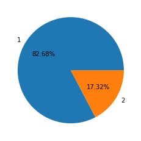
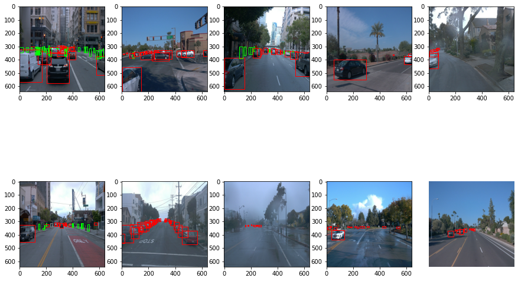

# Project Writeup Template
## Project overview: 


The purpose of this project is using convolutional neural network to detect and classify objects using data from Waymo.We Can use camera get more information than other information likes color of detected objects.
## Set up: 
This section should contain a brief description of the steps to follow to run the code for this repository.
Dataset
### Commit information
Please open [commit log](https://github.com/wtc842017068/Udacity_Object-Detection-in-an-Urban-Environment/commits?author=wtc842017068)

### 0.init the data set
```python
# init train data set
cd /home/workspace/experiments/pretrained_model/

wget http://download.tensorflow.org/models/object_detection/tf2/20200711/ssd_resnet50_v1_fpn_640x640_coco17_tpu-8.tar.gz

tar -xvzf ssd_resnet50_v1_fpn_640x640_coco17_tpu-8.tar.gz

rm -rf ssd_resnet50_v1_fpn_640x640_coco17_tpu-8.tar.gz

# gen config file
cd /home/workspace/
python edit_config.py --train_dir /home/workspace/data/train/ --eval_dir /home/workspace/data/val/ --batch_size 2 --checkpoint /home/workspace/experiments/pretrained_model/ssd_resnet50_v1_fpn_640x640_coco17_tpu-8/checkpoint/ckpt-0 --label_map /home/workspace/experiments/label_map.pbtxt
```
### 1. using Exploratory Data Analysis.ipynb File to Exploratory Data 


You can find the origin code form the Linke [Exploratory Data Analysis.ipynb](Exploratory%20Data%20Analysis.ipynb)


### 2. Edit the  pipeline_new.config to improve the result of training
### 3. using Explore augmentations.ipynb File to show the data augmentations result

Please open file [augmentations.ipynb](Explore%20augmentations.ipynb)


### 4. run training code 
``` python
python experiments/model_main_tf2.py --model_dir=experiments/reference/ --pipeline_config_path=experiments/reference/pipeline_new.config

```
### 5. run testsing code
``` python
python experiments/model_main_tf2.py --model_dir=experiments/reference/ --pipeline_config_path=experiments/reference/pipeline_new.config --checkpoint_dir=experiments/reference/

```
### 6. export model and animation.gif
```
python experiments/exporter_main_v2.py --input_type image_tensor --pipeline_config_path experiments/reference/pipeline_new.config --trained_checkpoint_dir experiments/reference/ --output_directory experiments/reference/exported/

python inference_video.py --labelmap_path label_map.pbtxt --model_path experiments/reference/exported/saved_model --tf_record_path data/test/segment-12200383401366682847_2552_140_2572_140_with_camera_labels.tfrecord --config_path experiments/reference/pipeline_new.config --output_path animation.gif

```


## Dataset Analysis: 
#### 1.1 we analysisi the distribution of the category:

##### **Show the sample pictures**


Above the sample i draw a pie pictures,for the calculation the category.We can find out the most category is Vehichles.It is the triple than humans.

**Cross-validation**: 

we split data to 3 foled: test,train,val.
1. Train was used in training model
2. Test for check has overfitting.
3. Val data was to evaluating result in real word.

## Training

Now we notice the data set not enough data in low lights situation.So I used adjust_brightness config to light up or down the images.And some Vehichles or Humans will be occlude by other objects So we add crop_image config.

For augmentations i set random_crop_image parameters and random adjust_brightness
```python
    random_crop_image{
      min_object_covered: 0.0
      min_aspect_ratio: 0.75
      max_aspect_ratio: 3.0
      min_area: 0.75
      max_area: 1.0
      overlap_thresh: 0.0
      random_coef:0.5
    }
    random_adjust_brightness{
    max_delta:0.8
    }
```

<table>
    <tr>
        <th>
        <image src="images/origin——image1.png" >
        </th>
        <th>
        <image src="images/origin——image2.png" >
        </th>
    </tr>
    <tr>
        <th><center><div style="color:orange; border-bottom: 1px solid #d9d9d9;
        display: inline-block;
        color: #999;
        padding: 2px;">origin image1</div>
        </center></th>
    <th> <center><div style="color:orange; border-bottom: 1px solid #d9d9d9;
        display: inline-block;
        color: #999;
        padding: 2px;">origin image2</div></center>
        </th>
    </tr>
    <tr>
        <th>
        <image src="images/augument_image1.png" >
        </th>
        <th>
        <image src="images/augument_image2.png" >
        </th>
    </tr>
    <tr>
        <th><center><div style="color:orange; border-bottom: 1px solid #d9d9d9;
        display: inline-block;
        color: #999;
        padding: 2px;">augmentations image1</div>
        </center></th>
    <th> <center><div style="color:orange; border-bottom: 1px solid #d9d9d9;
        display: inline-block;
        color: #999;
        padding: 2px;">augmentations image1</div></center>
        </th>
    </tr>
</table>

#### The augmentations result is Above pictures 
The final result show in image animation.gif.
Please open file [animation.gif](animation.gif)